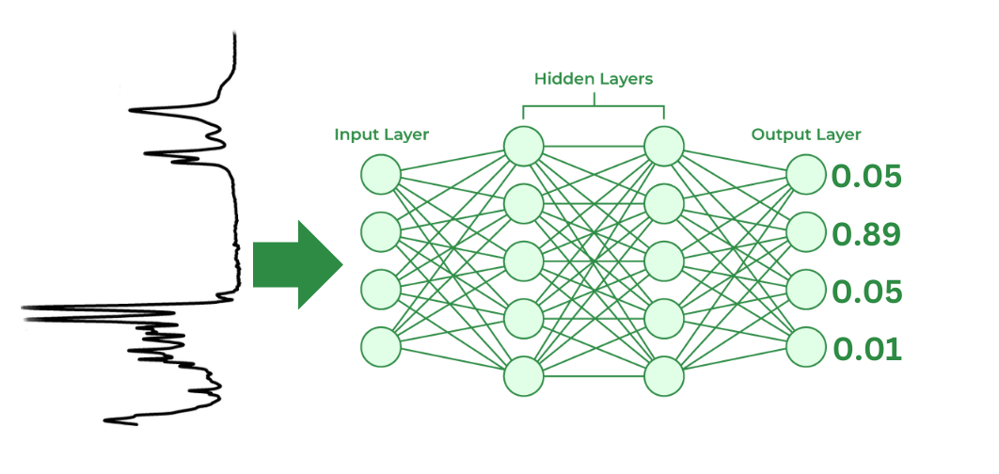
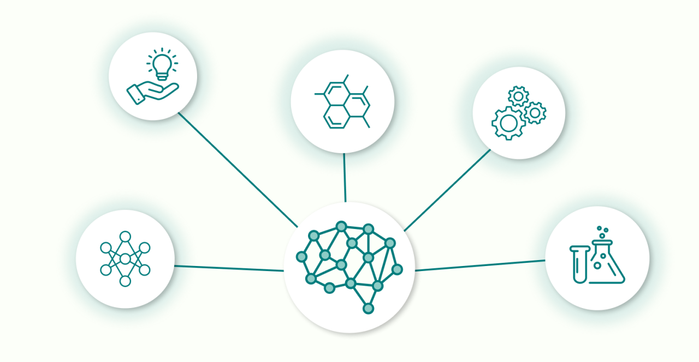

# ML_Chem

# CodeBase WalkThrough

## |- Documentation  -> pdf Explaining project and implementation
## |- Info           -> Images for ReadMe
## |- Main_Code      -> Main CodeBase
##    |- Spectrometry_IR     -> Ir Spectra AI
##        |- NIST                  -> AI_Versions_NIST
##            |- AI_Versions_NIST      -> AI verions
##            |- Mk_Dataset_NIST       -> Making the Dataset
##        |- SDBS                  -> SDBS (Database)(Same Structure)
##    |- Cristalography_XRD        -> Images for ReadMe

Nesse projeto mostramos a aplicabilidade de Diversas arquiteturas de Redes Neurais para área de espectroscopia, onde usamos ondas, como Raio-x e  Infravermelho para analisar de diversas formas a estrutura de diversos tipos e famílias de moléculas. 

# Proposta

## Mostrar a aplicabilidade de Redes Neurais a problemas quimicos, aprendendo atravez de grandes bases de dados.

Nesse projeto mostramos a aplicabilidade de Diversas arquiteturas de Redes Neurais para área de espectroscopia, onde usamos ondas, como Raio-x e  Infravermelho para analisar de diversas formas a estrutura de diversos tipos e famílias de moléculas. 

Baixe a documentação para mais detalhes: 

[Clique aqui para baixar a documentação](Documentation/Documentation.pdf?raw=true)

# PyTorch

Usamos a biblioteca PyTorch para criar e treinar a nossa RN. Acelerando o processo de treinamento e criando uma rede neural usando uma GPU. PyTorch e uma biblioteca de Python, que nos permite criar modelos de deep learning de forma simples e manipular tensores (matrizes multidimensionais) de forma extremamente eficiente.

# Inteface final e plano de expansão

Este projeto pode ser expandido para a predição de outros tipos de dados quimicos, como por exemplo, a predição da energia de uma molecula, ou a predição da sua reatividade, entre outros. 

# Como ajudar:

Entre em contato comigo pelo Telegram [@Ian_dhcb](https://t.me/Ian_dhcb)

Prescisamos achar mais problemas interessantes para resolver, assim como uma vez resolvido, tranformar a solucao em um produto facilemnte utilizavel e escalavel.

# Contato

Entre em contato!!

- Email: idhcb.ian@gmail.com
- Site: [iansmainframe.tech](http://iansmainframe.tech)

